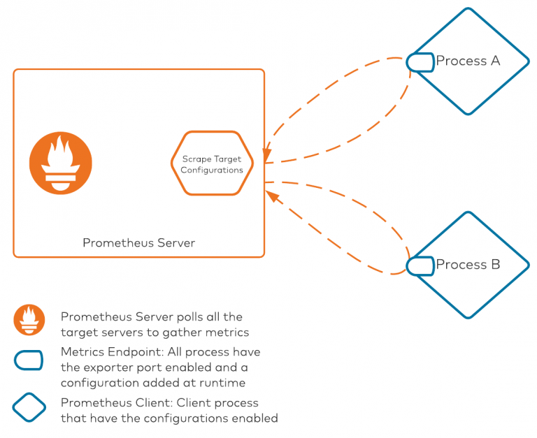
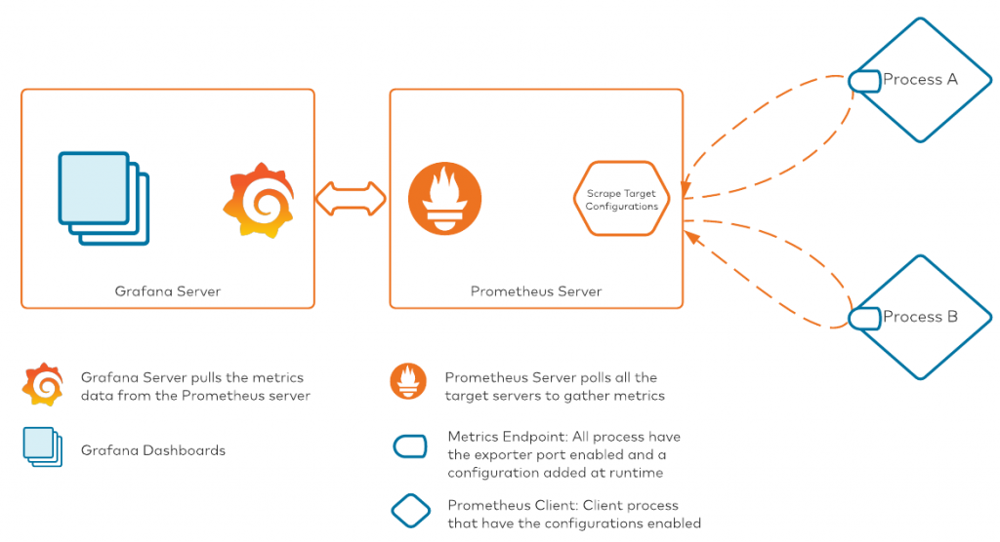
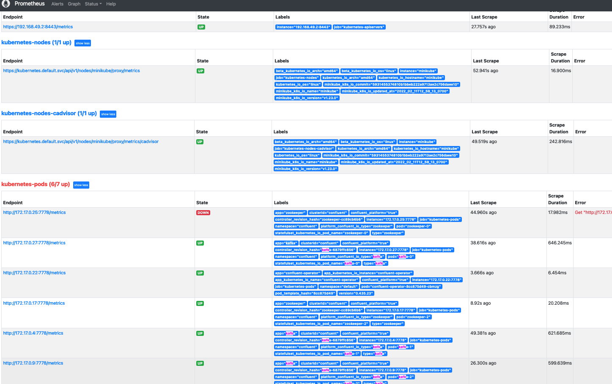

# How to deploy prometheus and grafana

I had to change some of the default values in the [source](https://github.com/confluentinc/confluent-operator/tree/master/test/soak#deploy-confluent-operator-cluster-scope) to make the dashboards work with my minikube. In here I outline the steps and give json file for the dashboard. 

## But what is it??? 

### Prometheus

Prometheus is a tool used for aggregating multiple platform metrics while scraping hundreds of endpoints. It is purpose-built for scrape and aggregation use cases.

How does Prometheus work?

Prometheus is an ecosystem with two major components: the server-side component and the client-side configuration. The server-side component is responsible for storing all the metrics and scraping all clients as well. Prometheus differs from services like Elasticsearch and Splunk, which generally use an intermediate component responsible for scraping data from clients and shipping it to the servers. Because there is no intermediate component scraping Prometheus metrics, all poll-related configurations are present on the server itself.

There are two core pieces in this diagram:

1. Prometheus server: This component is responsible for polling all of the processes/clients with their metrics exposed on a specific port. The Prometheus server internally maintains a configuration file that lists all the server IP addresses/hostnames and ports on which Prometheus metrics are exposed. The scrape target configuration is the file that keeps all target mapping within Prometheus. Scrape targets are required when we are deploying everything manually without any automation. Prometheus also supports service discovery modules, which it can leverage to discover any available services that are exposing metrics. This auto-discovery is an amazing tool when used with Kubernetes-based deployments, where Pod names (among other elements) are ephemeral. To keep it simple, Prometheus service discovery won't be covered in this post.

2. Client processes: All clients that want to leverage Prometheus will need two configuration pieces. First, they must use the Prometheus client library to expose metrics in a Prometheus compatible format (OpenMetrics). Secondly, they must use a YAML configuration file for extracting JMX metrics. This configuration file is used for converting, renaming, and filtering some of the attributes for consumption. The YAML configuration file is necessary for the JVM client, as the JVM MBeans are exposed, converted, and/or renamed to a specific format for consumption using this configuration file.

### Grafana

When you have metrics data streaming into the Prometheus server, we can start dashboarding our metrics. The tool of choice in our stack is Grafana. Conceptually, here's how the process will look once we have connected Grafana to Prometheus:

## Commands To Deploy K8S

Make sure to run following commands 
- `helm repo add stable https://charts.helm.sh/stable`
- `helm repo add prometheus-community https://prometheus-community.github.io/helm-charts`
- `helm repo add grafana https://grafana.github.io/helm-charts`
- `helm repo update`

## Helm Charts: Deploy Prometheus service

Install

- `helm upgrade --install -f addons/prometheus/values.yaml confluent-prometheus prometheus-community/prometheus --namespace confluent`

- Port Forward for the prometheus *server*
- `export POD_NAME=$(kubectl get pods --namespace confluent -l "app=prometheus,component=server" -o jsonpath="{.items[0].metadata.name}")`
- `kubectl --namespace confluent port-forward $POD_NAME 9090`
 
Open URL http://localhost:9090 to see all the targets  http://localhost:9090/targets and [query some metrics for example](http://localhost:9090/graph?g0.expr=kafka_server_replicamanager_value&g0.tab=1&g0.stacked=0&g0.show_exemplars=0&g0.range_input=1h&g1.expr=&g1.tab=1&g1.stacked=0&g1.show_exemplars=0&g1.range_input=1h)  

## Helm Charts: Deploy Grafana service

Install

- `helm upgrade --install -f addons/grafana/values.yaml confluent-grafana grafana/grafana --namespace confluent`

- Get the `admin` user password

- `kubectl get secret --namespace confluent confluent-grafana -o jsonpath="{.data.admin-password}" | base64 --decode ; echo`

- Port Forward
- `export POD_NAME=$(kubectl get pods --namespace confluent -l "app.kubernetes.io/name=grafana" -o jsonpath="{.items[0].metadata.name}")`
- `kubectl --namespace confluent port-forward $POD_NAME 3000`

Open URL at http://localhost:3000  use admin and password from before

Add data source in Grafana UI: Prometheus

Add following HTTP URL and make sure to `save and test`

http://confluent-prometheus-server.confluent.svc.cluster.local

The new page will have a URL with a UID in it:  `http://localhost:3000/datasources/edit/RxmrY5HVz` 
copy the UID (for example `RxmrY5HVz`)

Change the datasource UID in the provided file `cp-grafana.json`

Replace `"uid": "RxmrY5HVz"` with your own, the new UID from before. 

Deploy CP grafana dashboard
- Import dashboard for CP: `cp-grafana.json`
- Import dashboard for Operator: `operator-grafana.json`

## Reference 

Great article to read about [monitor-kafka-clusters-with-prometheus-grafana-and-confluent](https://www.confluent.io/blog/monitor-kafka-clusters-with-prometheus-grafana-and-confluent)

[Link to source](https://github.com/confluentinc/confluent-operator/tree/master/test/soak#deploy-confluent-operator-cluster-scope)