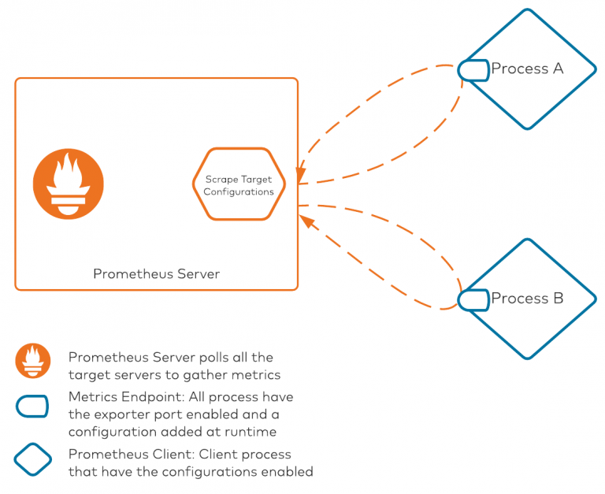
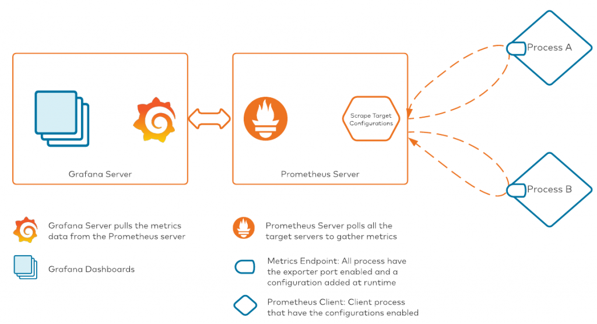

# MonitoringCPAnsible

Repo to show case monitoring of CP platform deployed via cp-ansible.    
Users should be able to pull JMX from the cluster using the following ports:  `9090/3000`.  

Supports metrics aggregation using JMX/Jolokia.  
Supports aggregated metrics export to Prometheus.  


## Jolokia 

 [Jolokia](https://jolokia.org/) is a JMX-HTTP bridge giving an alternative to JSR-160 connectors. It is an agent based approach with support for many platforms. In addition to basic JMX operations it enhances JMX remoting with unique features like bulk requests and fine grained security policies. 

Since the Jolokia run in agent mode on Kafka's class path, it will connect to Kafka monitoring MBeans and will provide metrics on HTTP interface.


## Prometheus

Prometheus is a tool used for aggregating multiple platform metrics while scraping hundreds of endpoints. It is purpose-built for scrape and aggregation use cases.

How does Prometheus work?

Prometheus is an ecosystem with two major components: the server-side component and the client-side configuration. The server-side component is responsible for storing all the metrics and scraping all clients as well. Prometheus differs from services like Elasticsearch and Splunk, which generally use an intermediate component responsible for scraping data from clients and shipping it to the servers. Because there is no intermediate component scraping Prometheus metrics, all poll-related configurations are present on the server itself.




There are two core pieces in this diagram:

1. Prometheus server: This component is responsible for polling all of the processes/clients with their metrics exposed on a specific port. The Prometheus server internally maintains a configuration file that lists all the server IP addresses/hostnames and ports on which Prometheus metrics are exposed. The scrape target configuration is the file that keeps all target mapping within Prometheus. Scrape targets are required when we are deploying everything manually without any automation. Prometheus also supports service discovery modules, which it can leverage to discover any available services that are exposing metrics. This auto-discovery is an amazing tool when used with Kubernetes-based deployments, where Pod names (among other elements) are ephemeral. To keep it simple, Prometheus service discovery won't be covered in this post.

2. Client processes: All clients that want to leverage Prometheus will need two configuration pieces. First, they must use the Prometheus client library to expose metrics in a Prometheus compatible format (OpenMetrics). Secondly, they must use a YAML configuration file for extracting JMX metrics. This configuration file is used for converting, renaming, and filtering some of the attributes for consumption. The YAML configuration file is necessary for the JVM client, as the JVM MBeans are exposed, converted, and/or renamed to a specific format for consumption using this configuration file.

## Grafana

When you have metrics data streaming into the Prometheus server, we can start dashboarding our metrics. The tool of choice in our stack is Grafana. Conceptually, here's how the process will look once we have connected Grafana to Prometheus:




## CP-ansible

With [cp-ansible](https://docs.confluent.io/ansible/current/overview.html) you can with 2 properties enabled jolokia and Prometheus agents. 

```
  vars:
    ansible_connection: ssh
    ansible_user: ec2-user 
    ansible_become: true
    ansible_ssh_private_key_file: key.pem
    ansible_ssh_common_args: '-o StrictHostKeyChecking=no'

    jmxexporter_enabled: true
    jolokia_enabled: true
```

### Expected ports 

The variables doc in the [cp-ansible repo outlines](https://github.com/confluentinc/cp-ansible/blob/7.3.2-post/docs/VARIABLES.md) the following ports for jolokia and jmxexporter

```
% grep -A 4  _jolokia_port  platform/docs/VARIABLES.md | egrep "###|Default"
### zookeeper_jolokia_port
Default:  7770
### kafka_broker_jolokia_port
Default:  7771
### schema_registry_jolokia_port
Default:  7772
### kafka_rest_jolokia_port
Default:  7775
### kafka_connect_jolokia_port
Default:  7773
### ksql_jolokia_port
Default:  7774
### kafka_connect_replicator_jolokia_port
Default:  7777

% grep -A 4  _jmxexporter_port platform/docs/VARIABLES.md | egrep "###|Default"
### zookeeper_jmxexporter_port
Default:  8079
### kafka_broker_jmxexporter_port
Default:  8080
### schema_registry_jmxexporter_port
Default:  8078
### kafka_rest_jmxexporter_port
Default:  8075
### kafka_connect_jmxexporter_port
Default:  8077
### ksql_jmxexporter_port
Default:  8076
```


### Enable JMX Exporter

JMX Exporter is disabled by default. When enabled, the JMX Exporter jar is pulled from the internet and enabled on all Confluent Platform components besides Confluent Control Center.

#### Enable JMX Exporter in hosts.yml as below:

```
all:
  vars:
    jmxexporter_enabled: true
```

### Enable Jolokia

Jolokia monitoring is disabled by default for Confluent Platform components when installed by Ansible Playbooks for Confluent Platform.

#### Enable Jolokia in hosts.yml as shown below:

```
all:
  vars:
    jolokia_enabled: true
```
## Install Confluent Platform 

Follow this [guide](install-with-cp-ansible.md)  


## Check if it's working 

ssh into one of the nodes and check the port jolokia is serving on, also validate the port that JMX Exporter is serving on. 
In this example we check a zookeeper node which has jolokia serving on port `7770` and JMX Exporter on port `8079`.  

```
[ec2-user@ip-192-168-4-72 ~]$ ps -ef | grep -i zook
cp-kafka   70254       1  0 Jan24 ?        00:02:27 java -Xmx1g -server -XX:+UseG1GC -XX:MaxGCPauseMillis=20 -XX:InitiatingHeapOccupancyPercent=35 -XX:+ExplicitGCInvokesConcurrent -XX:MaxInlineLevel=15 -Djava.awt.headless=true -Xlog:gc*:file=/var/log/kafka/zookeeper-gc.log:time,tags:filecount=10,filesize=100M -Dcom.sun.management.jmxremote -Dcom.sun.management.jmxremote.authenticate=false -Dcom.sun.management.jmxremote.ssl=false -Dkafka.logs.dir=/var/log/kafka -Dlog4j.configuration=file:/etc/kafka/zookeeper-log4j.properties -cp /usr/bin/../ce-broker-plugins/build/libs/*:/usr/bin/../ce-broker-plugins/build/dependant-libs/*:/usr/bin/../ce-auth-providers/build/libs/*:/usr/bin/../ce-auth-providers/build/dependant-libs/*:/usr/bin/../ce-rest-server/build/libs/*:/usr/bin/../ce-rest-server/build/dependant-libs/*:/usr/bin/../ce-audit/build/libs/*:/usr/bin/../ce-audit/build/dependant-libs/*:/usr/bin/../ce-authorizer/build/libs/*:/usr/bin/../ce-authorizer/build/dependant-libs/*:/usr/bin/../share/java/kafka/*:/usr/bin/../share/java/confluent-metadata-service/*:/usr/bin/../share/java/rest-utils/*:/usr/bin/../share/java/confluent-common/*:/usr/bin/../share/java/ce-kafka-http-server/*:/usr/bin/../share/java/ce-kafka-rest-servlet/*:/usr/bin/../share/java/ce-kafka-rest-extensions/*:/usr/bin/../share/java/kafka-rest-lib/*:/usr/bin/../share/java/confluent-security/kafka-rest/*:/usr/bin/../share/java/confluent-security/schema-validator/*:/usr/bin/../support-metrics-client/build/dependant-libs-2.13.10/*:/usr/bin/../support-metrics-client/build/libs/*:/usr/bin/../share/java/confluent-telemetry/*:/usr/share/java/support-metrics-client/* -javaagent:/opt/jolokia/jolokia.jar=config=/etc/kafka/zookeeper_jolokia.properties -javaagent:/opt/prometheus/jmx_prometheus_javaagent.jar=8079:/opt/prometheus/zookeeper.yml org.apache.zookeeper.server.quorum.QuorumPeerMain /etc/kafka/zookeeper.properties
ec2-user   83546   74019  0 16:29 pts/1    00:00:00 grep --color=auto -i zook

[ec2-user@ip-192-168-4-72 ~]$ sudo cat /etc/kafka/zookeeper_jolokia.properties
port=7770
host=0.0.0.0


[ec2-user@ip-192-168-4-72 ~]$ curl http://localhost:7770/jolokia/list | tail -n 5
  % Total    % Received % Xferd  Average Speed   Time    Time     Time  Current
                                 Dload  Upload   Total   Spent    Left  Speed
100 51796    0 51796    0     0   304k      0 --:--:-- --:--:-- --:--:--  304k
{"request":{"type":"list"},"value":{"JMImplementation":{"type=MBeanServerDelegate":{"attr":{"ImplementationName":{"rw":false,"type":"java.lang.String","desc":"The JMX implementation name (the name of this product)"},"MBeanServerId":{"rw":false,"type":"java.lang.String","desc":"The MBean server agent identification"},"ImplementationVersion":{"rw":false,"type":"java.lang.String","desc":"The JMX implementation version
..
..


[ec2-user@ip-192-168-4-72 ~]$ curl http://localhost:8079/metrics | tail -n 5
  % Total    % Received % Xferd  Average Speed   Time    Time     Time  Current
                                 Dload  Upload   Total   Spent    Left  Speed
100 27836  100 27836    0     0  3397k      0 --:--:-- --:--:-- --:--:-- 3397k
# TYPE jvm_classes_unloaded_total counter
jvm_classes_unloaded_total 0.0
# HELP jvm_info JVM version info
# TYPE jvm_info gauge
jvm_info{version="17.0.6+10-LTS",vendor="Red Hat, Inc.",runtime="OpenJDK Runtime Environment",} 1.0
```

## Create a ec2 instance with Prometheus and Grafana

Now that you have a working components you can go ahead and install a Prometheus and Grafana to explore a bit further. 

Follow this [guide](installPrometheusAndGrafana.md) to install and configure your first dashboard

## Reference 

[Confluent Docs](https://docs.confluent.io/ansible/current/ansible-configure.html#enable-jmx-exporter)
[Confluent Blog](https://www.confluent.io/blog/monitor-kafka-clusters-with-prometheus-grafana-and-confluent/?_ga=2.28670844.1574239109.1674464926-1092077398.1613042839)

